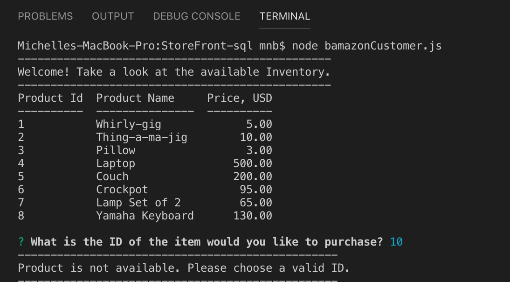
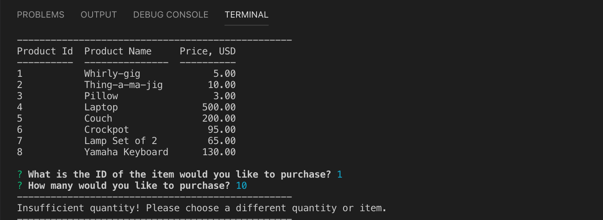
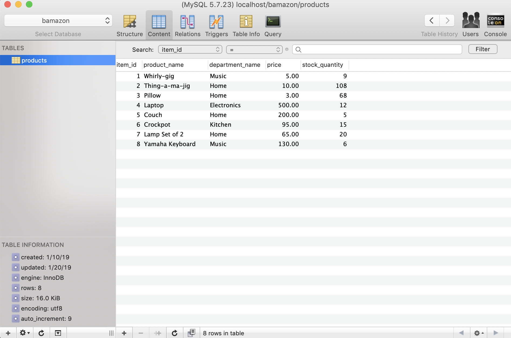
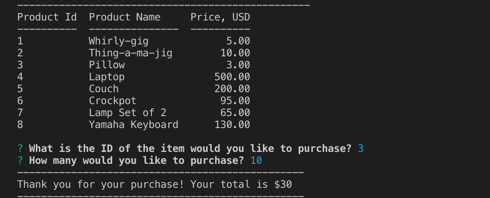
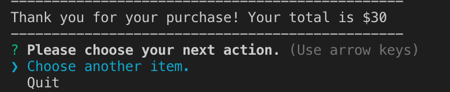
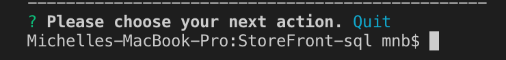

# StoreFront-sql

## Video Link
Here is the [link](https://drive.google.com/file/d/1ZwEy-sQV1FLUR6aRxpFwTDXVANuSXFRr/view?usp=sharing) to the flow of this application.

## Instructions

User can load the application by entering `node bamazonCustomer.js`. This code displays the available inventory and asks which 
item ID the user would like to purchase. In the below screenshot, if the user selects an item ID that does not exist. The application displays an error "Product is not available. Please choose a valid ID." and then re-displays the available inventory.

If a valid item id is selected, the application prompts the user to select how many of the selected item they would like to purchase. If the available quantity in the database is the less than the quantity selected by the user, the application returns "Insufficient quantity! Please choose a different quantity or item." and re-displays the available inventory.

If the user selects a quantity that is available in the database, the application processes the request and subtracts the requested amount from the database. The application gives the user the following response: "Thank you for your purchase! Your total is $ (total price)." 

After a successful purchase, the application prompts the user to either purchase another item or to quit the application. The quit function exits Node.

